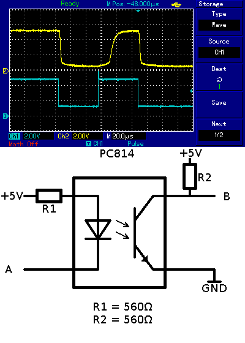
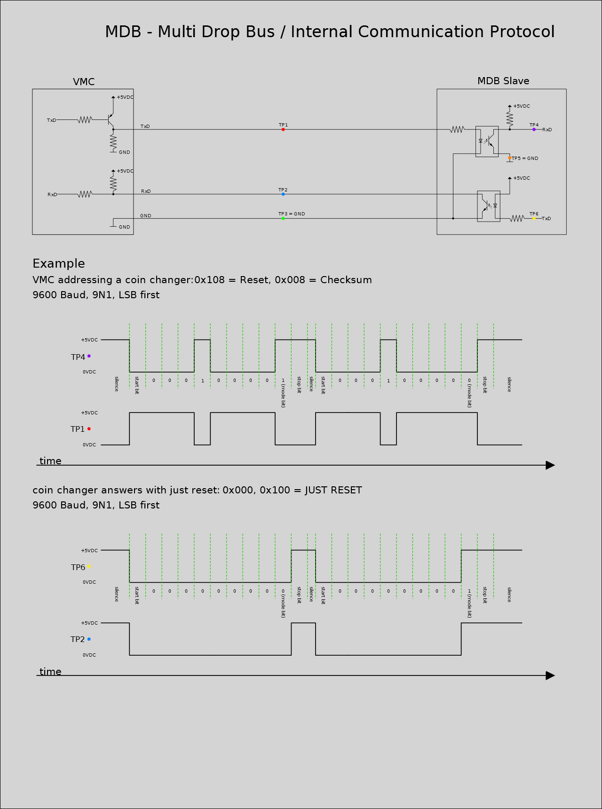
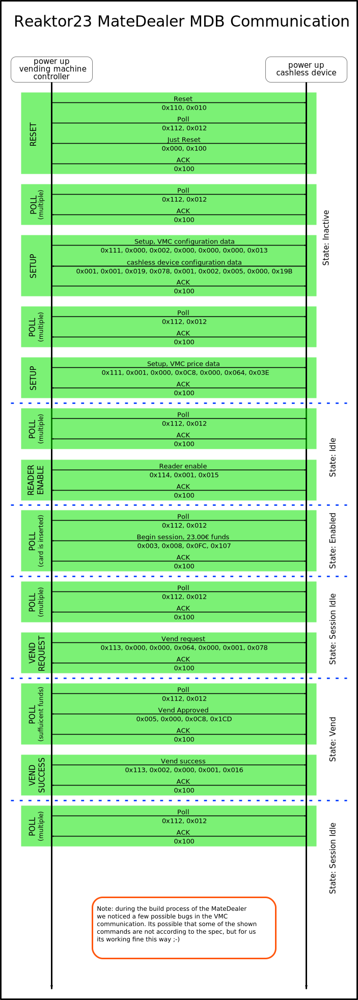

There is a enlish version of this site: [Mate Dealer](projects:mate_dealer_en)

Der MateDealer in der hier beschriebenen Konfiguration ist tot.
Die Mechanischen Teile werden für den [MateDealer 2.0](projects:matedealer2) benutzt.

# Der Ausgangszustand

* Hersteller: [Sanden Vendo](http://www.sandenvendo.com/)
* Model: VDI 100-5
* 5 Produktschächte
* Betriebsspannung: 230VAC 50Hz
* Nominale Leistungsaufnahme: 450W
* Gewicht: 200kg
* Baujahr: 02/2003
* Kaufpreis: ~400 €
* Münzprüfer [NRI](http://www.nri.de/) G40.4000/4-0752 (EUR & GBP)

\\
So sah der Automat aus als wir ihn abgeholt haben.

# Unterlagen zum Automaten

* [Einstell Anleitung für die BB01 Steuerplatine](bb01_einstellanleitung_080306_de.pdf)
* [Programmieranleitung für den Automaten](vendo_vdi_100-5_programmieranleitung.pdf)
* [Handbuch zum Münzprüfer](g46f4000_de.pdf)
* [Verfügbare Tubenvarianten des Münzprüfers](tubenvarianten_g46.pdf)
* [Spezifikation zum MDB Protokoll](mdb_version_4-2.pdf)
* [Ein Log der Kommunikation vom 13.12.2011](matedealer13.12.2011.rar)

## Verschiedenste Dokumente zu Sanden Vendo Geräten

[Ein ?FTP? mit PDF's](http://109.170.209.5:591/Part%20Manuals/Vendo/)

---------------
# Projekt History

## Dezember 2010

* 04.12.2010: Wir haben die ersten Logs der Kommunikation zwischen VMC und Münzprüfer aufgezeichnet.

## Januar 2011

* 25.01.2011: Nach einiger Zeit des Lesens der MDB Spezifikation haben wir erste Versuche unternommen mit einem Optokoppler und dem STK500 + AtMega644P die Kommunikation zwischen Münzprüfer und VMC mitzulesen. Leider hatten wir keinen Erfolg was vermutlich am gewählten Optokoppler Typ liegt (PC814)

## Februar 2011

* 19.02.2011: Nachdem wir im Dezember Log festgestellt hatten das der VMC das Chashless Device welches wir mit hilfe des AtMegas simulieren wollen nicht adressiert, haben wir beim Hersteller des Automaten ein neues EEPROM gekauft, und diesers nun eingebaut. Im neuen Log ist schön zu sehen das das Cashless Device adressiert wird.

## März 2011

* 01.03.2011: Nach dem wir von einem PC814 auf einen PC817 umgestiegen sind klappt der Empfang immer noch nicht wie gedacht. Die Nachfolgenden Bilder zeigen was mit dem Oszi sichtbar wurde. Die steigenden Flanken (untere Bildhälfte) steigen viel zu langsam an. im ersten Bild ist ein 10k Pullup verwendet worden, im zweiten dann ein 1k5. \\ 

* 12.03.2011: Heute wurde ein Versuch unternommen mit schnellen PC900 Optokopplern das Problem in den Griff zu bekommen. Ergebinis ist ein gesprengter PC900 und ein gelöschtes/defektes ROM im Münzprüfer. Nach dem Test wurde das PC817 Board nochmal angeschlossen und mit diesem ein Test mit kleinerem Pullup (470R) und einem grösseren Vorwiderstand (560R) gemacht und das brachte den ersehnten Erfolg. 

**Milestone** Der Empfang der MDB Daten klappt nun wie gedacht.

* 23.03.2011: Seit heute klappt nun auch das senden von MDB Kommandos

**Milestone** Das senden von MDB Daten klappt nun auch.

## April 2011

* 15.04.2011: Die ersten Gehversuche sind gemacht. Das MDB Protokoll ist ein wenig komisch aber wir lassen uns nicht entmutigen.

* 20.04.2011: Die ersten Befehle (RESET, SETUP) sind implementiert und funktioneieren auch schon. Das ausgeben eines Getränks ist aber noch nicht möglich.

* 21.04.2011: Das erste Getränk wurde dem Automaten entlockt. Irgendetwas scheint aber noch nicht zu passen, da das eher Zufall war.

* 22.04.2011: Wie es aussieht ist ein fetter Bug im Code. Wenn man sich "beeilt" bekommt man ein Getränk aus dem Automaten, wenn man aber zu lange wartet versagt die ganze Kommunikation.

* 30.04.2011: Das Problem ist gefunden. Ein Fehlerhaft implementierter FiFo Buffer war die Ursache. Wenn man vor dem Überlauf das Getränk bezogen hat ging es, danach ging etwas schief. Nach dem beheben des Fehlers klappt das beziehen eines Getränks nun ohne Probleme. Das ganze ist momentan über 2 Taster gelöst. Taster 1 ist das authentifizieren eines Kunden am Automaten mit einem Festen Guthaben von 23€. Taste 2 ist das freigeben des Ausgabevorganges mit fixen 2€ Getränkepreis.

**Milestone* Es ist nun möglich ein Getränk aus dem Automaten zu ziehen.

## August 2011

* 01.08.2011: In den letzten Monaten wurde der Code weitreichend überarbeitet. Beide Seriellen Verbindungen (MDB,Uplink) sind nun sowohl sendend als auch empfangend mit einem FiFo gepuffert. Ausserdem geschieht das Empfangen und senden im Interrupt Betrieb. Auch die anfangs verwendeten while Schleifen um auf neue Daten zu warten wurden erstezt und es ist nun mehr Zeit etwas sinnvolles in de Main Loop zu tun. 

* 02.08.2011: Heute wurde das zusammenspiel des Python Scripts auf dem SingleBoard PC mit der uC Schaltung getestet. Nun kann für mehrere Benutzer in einer Datenbank ein Guthaben hinterlegt werden von dem beim Bezug eines Getränks abgebucht wird. Ebenso werden Getränkpreise in der Datenbank hinterlegt und der Verbrauch der einzelnen Getränkesorten geloggt um eine kleine Statistik über den Verbrauch und die Beliebtheit erstellen zu können. Dies geschieht nicht Personenbezogen.

**Milestone** Das Backend ist in einer frühen alpha Phase funktioniert aber schon gut.

## September 2011

* 20.09.2011 Es wurde der Entschluss gefasst das Projekt auf ein Arduino Board zu portieren.

## Oktober 2011
* Die Portierung ist immer noch im Gange wenn auch langsamer als gedacht. Die Idee vom Anfang das ganze in "Arduino Code" zu portieren wurde verworfen. es wird sich wieder um reinen C-Code handeln, denn die Arduino Serial Lib unterstützt keine anderen Modi als 8,N,1
## November 2011 
* ein fauler monat
## Dezember 2011 
* ein weiterer fauler monat
## Januar 2012 
* 10.01.2012 Heute wurden einige Aufzeichnungen mit dem Oszi gemacht um gute Widerstandswerte für Rv und Pullup der Optokoppler zu ermitteln. Die Ergebnisse sind nicht besonders gut, aber ausreichend.

hellblau ist die LED Seite an der das Arduino Board hängt, gelb die Transistorseite. Übertragen wurde mit 9600Baud.

## February 2012 
* kein Fortschritt
## March 2012 
* kein Fortschritt
## April 2012 
* kein Fortschritt
## May 2012 
* kein Fortschritt (Aber die Hoffnung das Projekt wiederzubeleben ;) )

## Juni 2012 
* Ich habe die Zeit gefunden an meinem Code rewrite weiter zu arbeiten, evtl. kann die nächsten Dienstage ein Test stattfinden :) Yeah baby, yeah ---Bouni 

## Juli 2012 
* **04.07.2012** Am gestrigen Dienstag hab ich endlich wieder am MateDealer weiter gearbeitet. Ich hab zwar den Code nicht vollständig fertig bekommen, aber etliche Fehler gefunden und behoben und bis zum //begin session// funktioniert nun alles. Auch die Uplink Kommunikation funktioniert sauber. Ausserdem hab ich ein kleines Stück Lochstreifen Platine in ein "Arduino Mega MDB Shield" verwandelt und das hat auf Anhieb funktioniert. ---Bouni

* **11.07.2012** Wiederum am gestrigen Hackerspace Dienstag habe ich die (Grund)Funktionalität des MateDealers fertig gestellt. Es funktionieren nun die folgenden MDB Kommandos: RESET, SETUP, POLL, READER [ENABLE|DISABLE], VEND [REQUEST|SUCCESS]. Demenstprechend kann man nun eine Session starten, eine Getränk wählen, den Vend genehmigen, und das Resultat trinken ;)

* **17.07.2012** Seit heute funktioniert der Arduinoseitige Teil des Mate Dealers komplett.

## Juli 2013 
* **02.07.2013** Nach langem stillstand wurde heute eine lauffähige aber wahrscheinlich nicht sehr vertrauenswürdige Version der GUI auf dem single-board computer im MateDealer zum laufen gebracht. Weitere tests werden folgen.

** Ab hier werden Schwerwiegende Änderungen am MateDealer Projekt stattfinden.**

* **30.07.2013** Kurz bevor die Kids zum [FEZ Abend](events:fez2013) zu uns gekommen sind hat sich der 2te Schacht des Matedealers verabschiedet. Er zeigt an er sei leer obwohl das nicht der Fall ist. Das durchmessen der Leitung und der Test des Schalters lassen darauf schliessen das es sich um einen Defekt auf der VMC Platine handelt.
* Wenig später hat sich gleich noch ein weiterer Schacht verabschiedet.
* Nach kurzem überlegen wir es wohl darauf hinauslaufen, das wir ein komplett eigenes PCB anfertigen um die Steuerung des Automaten zu übernehmen, was nicht wirklich wild ist, denn es sind nur 5 Motoren (DC) und 10 Schalter (Schacht leer + Motor Position erreicht) zu bedienen. Ein weiterer Vorteil wird sein das das komplette MDB wegfällt und man viele Fehlerquellen eliminiert.
# Software 
Die Software die auf dem Arduino lauft ist auf [GitHub](https://github.com/Bouni/MateDealer) zu finden.

---------------
# Probleme & Lösungen 

## Falsche Münzrohre 
* **Problem:** Der Münzprüfer verfügt über 4 Münzspeicher, wovon jede eine Münzsorte aufnimmt (5Cent, 10Cent, 20Cent, 50Cent). Eine dieser sogenannten Tuben passte nicht zur programmierten Münze (20Cent) was dazu führte das sich die einfallenden Münzen querstellten. 
* **Lösung**: Der Hersteller hat uns freundlicherweise eine {{:projekte:mate_dealer:tubenvarianten_g46.pdf|Liste aller Tuben}} zugemailt und wir konnten die passende nachbestellen. 
* **Kosten:** ~11€ + MwSt. & Versand.

## Fehlender Schlüssel 
* **Problem:** Als wir den Automaten gekauft haben, war er offen und es gab keine Schlüssel zum eingebauten Schloss mehr. Da niemand unbefugtes Zugang zum Inneren des Automaten haben soll muss ein Schloss mit Schlüssel her.
* **Lösung**: Nach einiger Suche konnten wir ein Baugleiches Schloss in bei [www.coinoperatorshop.com](http://www.coinoperatorshop.com/shop/product_info.php?cPath=21_37_39_364&info=p5438_Lock-key-alike-T-Handle-inner-cylinder-lock.html) finden und bestellen. 
* **Kosten:** ~7€ + MwSt. & Versand.

## Cashless Device 
* **Problem:** Im Ausgangszustand war im VMC ein EEPROM mit einer alten Software Version verbaut. Dieses hat keine Cashless Devices adressiert.
* **Lösung**: Nach einem Telefonat mit dem Hersteller des Automaten, haben wir ein neues EEPROM mit der aktuellen Version der Software "BBMDEX5.14" bestellt. 
* **Kosten:** ~30€ + MwSt. & Versand.

## VMC Parametrierung 
* **Problem:** Nach dem einabu des neuen EEPROM hat sich die Menüstruktur zum parametrieren des Automaten geändert. Das Handbuch das wir mit dem Automaten bekommen hatten war somit nicht mehr wirklich zu gebrauchen.
* **Lösung**: Eine freundliche Anfrage beim hersteller später haben wir ein {{:projekte:mate_dealer:bb01_einstellanleitung_080306_de.pdf|aktuelles Manual}} per Mail bekommen. Es passt zwar auch nicht ganz zum Menü, aber besser als das alte ist es.
* **Kosten:** 0€

## Füllstandsüberwachung 
* **Problem:** Wenn man den Automaten bzw. einen Schacht bis oben hin füllt, passen ca. 25 Flaschen hinein. Der Wippschalter der den Füllstand überwacht meldet allerdings schon bei 10 verbleibenden Flaschen im Schacht das dieser leer sei.
* **Lösung**: Ein paar streifen 2mm Aluminium mit ~3x10cm und ein wenig Duct-Tape haben die Füllstandsüberwachung auf 1 verbleibende Flasche verbessert. 
* **Kosten**: 0€

---------------

# Wünsche und Ideen 

## Bargeldloses Bezahlen 
* **Idee:** Die Hauptmodfikation besteht darin das wir ein Bargeldloses Bezahlsystem entwickeln wollen. Realisiert wird das ganze in dem wir mit einem Mikrocontroller ein Cashless Device simulieren was wirderum über einen Single Borad PC der mit WLAN ausgestattet ist mit einem Server kommuniziert.
* **Entwicklungsstand:** 80%

## Genaue Füllstandsanzeige 
* **Idee:** Den Füllstand der einzelnen Schächte mit Hilfe Analoger Sensoren (Sharp GP2Y0A21YK0F) zu messen.
* **Entwicklungsstand:** 0%

## Temperatur Logging 
* **Idee:** Die Temperaturen im Kühlbereich des Automaten mit einem DS18S20 loggen.
* **Entwicklungsstand:** 0%

## Regelung des Kühlaggregates 
* **Idee:** Das Kühlaggregat mit dem uC regeln. Die verbaute Regelung mit Bimetall funktioniert nicht wirklich. Ausserdem lassen sich Nachtabsenkungen usw. Realisieren.
* **Entwicklungsstand:** 0%

## Display Scheibe 
* **Idee:** Die Scheibe des Automaten die von ihrer Mineralwasser Werbung befreit wurde mit einem RGB Dot Matrix Display ausstatten. Wie z.B. [das hier](http://www.youtube.com/watch?v=yzCAcbA51A0)
* **Entwicklungsstand:** 0%

# MDB Protokoll 

# Elektronik 

**20.09.2011**\\
Hab mich entschieden das Elektronik "Problem" mit einem **[Arduino Mega 2560](http://arduino.cc/en/Main/ArduinoBoardMega2560) + MEGA Proto PCB Shield** zu realisieren. Das macht das ganze für andere eher Nachbaubar. Die Kosten werden etwa im selben Rahmen wie die bei einem Eigenbau liegen.
Evtl. wird das Shield mal als gefertigtes PCB gemacht und zum Selbstkostenpreis verkauft. Ist dann ne saubere Lösung. Die Bestellung sollte die Tage bei mir eintrudeln. ---Bouni

## Grundlegende Beschaltung 

## Was alles auf die Platine soll 
* 1 Relais zum schalten des Kühlaggregates
* 1 Relais zum schalten des Lüfters
* Anschlüsse für 1-wire Sensoren
* Status LED's, evtl ein LCD 
* ...

# Authentification 

Die Authentification am Automaten soll mittels GNUPG Smartcard geschehen.
Wir sind schon im Besitz von 2 Card Readern vom Typ OmniKey CardMan
## How To zu GnuPG mit SmartCard
http://www.gnupg.org/howtos/card-howto/en/smartcard-howto-single.html

# Vergleichbare Projekte 
* [Nottinghack](http://wiki.nottinghack.org.uk/wiki/Vending_Machine/Cashless_Device)
* [CCC Muenchen](http://wiki.muc.ccc.de/matemat)
* [CCC Basel](http://wiki.chaostreff.ch/Mate_Automat)

